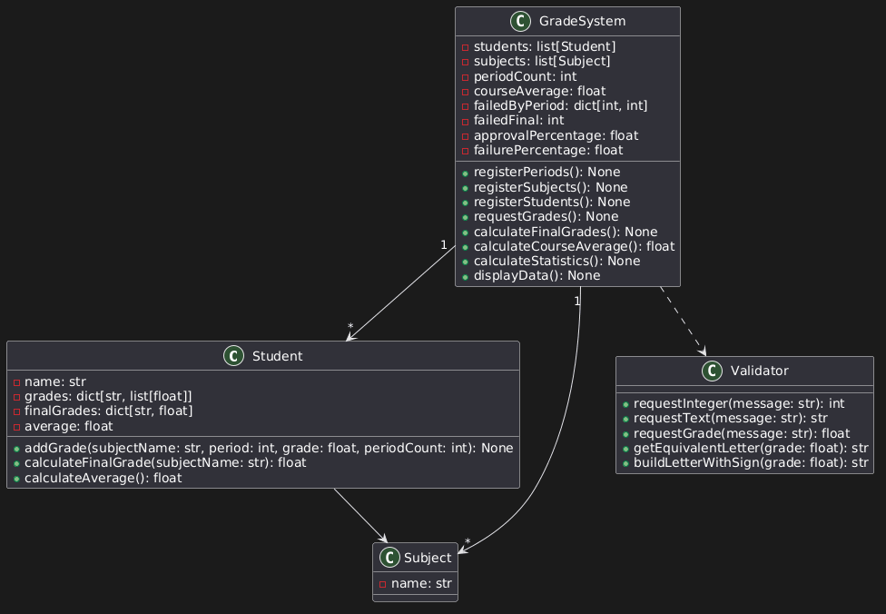

# SISTEMA DE NOTAS

Sistema en Python para registrar estudiantes, materias y notas por consola.

## Características

- Permite registrar múltiples estudiantes y materias
- Permite definir la cantidad de periodos (mínimo 3)
- Almacena las notas por periodo (estructura tipo matriz)
- Muestra los datos registrados

## Ejecución

1. Crear entorno virtual:

python -m venv venv

2. Activar entorno:

venv\Scripts\activate

3. Ejecutar:

python main.py

## DIAGRAMA UML

